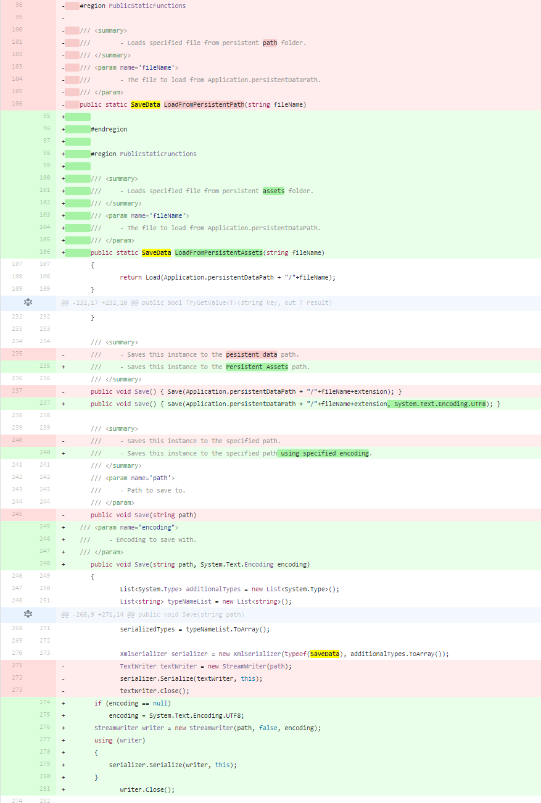

# What is SaveDataX?
A x-platform extension of the Save Data asset package by Arkham Interactive.

Due to the way the original package was encoding XML, on iOS builds you would see XmlExceptions thrown whenever you read or wrote data. [This comment on SO](http://stackoverflow.com/a/23063674/1340070) details why - **tl;dr** is the default encoding includes a BOM which causes errors when reading the XML.

SaveDataX encodes using UTF-8 as the default and has been refactored so developers can specify any encoding type they want if UTF-8 isn't their jam. SaveDataX also uses Unity's Application.persistentDataPath rather than streaming assets.

# Changes Made

There's an interactive HTML document in this repository if you want to review changes in detail, below is a screenshot of the diff.

# Original Author
Product : Save Data Package

Studio : Arkham Interactive

Asset Store: http://u3d.as/5tv

# Thank You

The original author wrote a fantastic asset that makes saving data permanently a cake-walk. This simple extension will hopefully make it more convenient and widely used.
